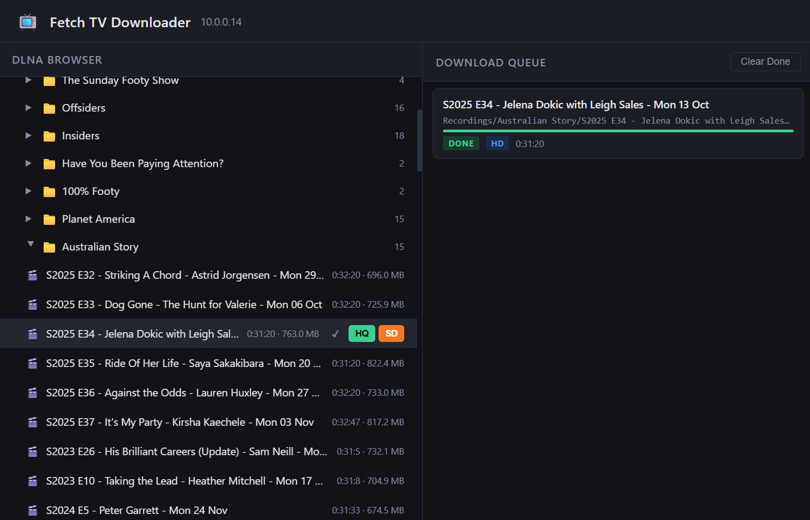

# Fetch TV Downloader

A web application for downloading recordings from a **Fetch TV** set-top box over its built-in DLNA/UPnP media server. Browse your recorded content, queue downloads at your chosen quality, and save them as `.mkv` files — all from a browser.



---

## Features

- **DLNA browser** — navigates the Fetch TV content directory tree, showing all recorded shows and episodes with file size and duration
- **Three quality options per download:**
  - **HD** — lossless remux of the original MPEG-TS stream, no re-encoding, full quality
  - **HQ** — re-encoded to H.264 CRF 20, AAC 192k, original resolution
  - **SD** — re-encoded to H.264 CRF 28, scaled to 720p, AAC 128k
- **Bulk download** — queue an entire show folder at once at any quality level
- **Download queue** — live progress tracking with percentage and status badges, powered by Server-Sent Events
- **Skip duplicates** — already-downloaded files are detected and skipped automatically
- **MKV output** — all recordings are remuxed or re-encoded into `.mkv` containers with subtitle streams stripped
- **Folder structure** — output mirrors the DLNA hierarchy (`Show Name/Episode Title.mkv`)

---

## How It Works

The Fetch TV box exposes its recordings via a **UPnP ContentDirectory** service (DLNA). This app communicates with that service using SOAP requests to browse the content tree and retrieve direct HTTP download URLs for each recording.

Downloads are streamed from the device and piped directly into **ffmpeg**, which either remuxes (HD mode) or transcodes (HQ/SD) into an MKV file. No intermediate temporary files are written to disk — the stream goes device → ffmpeg → output file.

```
Browser  ──HTTP──▶  FastAPI (port 8000)
                        │
                        ├─ SOAP Browse ──▶  Fetch TV DLNA (10.0.0.14:49152)
                        │
                        └─ HTTP Stream ──▶  Fetch TV ──▶ ffmpeg ──▶ /output/*.mkv
```

The backend is a single-file **FastAPI** application. The frontend is a single-page HTML/JS app served as a static file — no build step, no framework.

---

## Quality Presets

| Option | Encoding | Resolution | Audio | File size (1hr) |
|--------|----------|------------|-------|-----------------|
| **HD** | Stream copy (no re-encode) | Original | Original | ~8–14 GB |
| **HQ** | H.264 CRF 20, `fast` preset | Original | AAC 192k | ~3–6 GB |
| **SD** | H.264 CRF 28, `fast` preset | 720p max | AAC 128k | ~1–2 GB |

HD is the fastest option — ffmpeg just repackages the stream. HQ and SD require a full transcode and will use significant CPU.

---

## Requirements

- Docker (recommended), **or** Python 3.12+ with ffmpeg on PATH
- Network access to the Fetch TV box at `10.0.0.14:49152`
- The Fetch TV box must be powered on and connected to the same network

---

## Quick Start

### Docker

```bash
# Clone the repo
git clone https://github.com/gappleby/DlnaDownloadServer.git
cd DlnaDownloadServer

# Copy and configure environment
cp .env.example .env   # edit FETCH_HOST if your box is at a different IP

# Build and run
docker compose up -d --build
```

Open **http://localhost:8000**

### Python (local)

```bash
pip install -r requirements.txt
# ffmpeg must be on PATH: winget install ffmpeg

cd app
uvicorn main:app --host 0.0.0.0 --port 8000 --reload
```

---

## Configuration

All configuration is via environment variables (or the `.env` file when using Docker):

| Variable | Default | Description |
|----------|---------|-------------|
| `FETCH_HOST` | `10.0.0.14` | IP address of the Fetch TV box |
| `FETCH_PORT` | `49152` | DLNA port on the Fetch TV box |
| `OUTPUT_DIR` | `/output` | Directory where recordings are saved |
| `FFMPEG_PATH` | `ffmpeg` | Path to ffmpeg binary (if not on PATH) |

---

## Installing on a QNAP NAS

See [Install.md](Install.md) for step-by-step instructions using both the Container Station UI and docker-compose over SSH.

---

## API

The backend exposes a small REST API that the frontend uses. It can also be called directly for scripting.

| Method | Endpoint | Description |
|--------|----------|-------------|
| `GET` | `/api/browse/{object_id}` | List children of a DLNA container (`0` = root) |
| `POST` | `/api/download` | Add an item to the download queue |
| `GET` | `/api/queue` | Get current queue state |
| `DELETE` | `/api/queue/done` | Remove completed/errored items from queue |
| `GET` | `/api/progress` | SSE stream of real-time queue updates |
| `GET` | `/api/qualities` | List available quality presets |

**POST `/api/download` body:**
```json
{
  "title": "S2025 E34 - Jelena Dokic",
  "path": ["Recordings", "Australian Story"],
  "url": "http://10.0.0.14:49152/...",
  "size": 4831838208,
  "duration": "0:58:30.000",
  "quality": "hd"
}
```

---

## Project Structure

```
├── app/
│   ├── main.py          # FastAPI application
│   └── static/
│       └── index.html   # Single-page frontend
├── fetch_downloader.py  # Standalone CLI alternative (no dependencies)
├── Dockerfile
├── docker-compose.yml
├── requirements.txt
├── .env                 # Local config (not committed)
├── Install.md           # QNAP installation guide
└── .github/
    └── workflows/
        └── docker-publish.yml  # Builds and pushes to GHCR on push to main
```

---

## CLI Alternative

`fetch_downloader.py` is a self-contained script with no external dependencies (only ffmpeg required) for use without Docker:

```bash
# List all recorded shows
python fetch_downloader.py list

# Download everything
python fetch_downloader.py download --dest ./recordings

# Download a specific show (use ID from list command)
python fetch_downloader.py download --show-id 12 --dest ./recordings

# Preview without downloading
python fetch_downloader.py download --dry-run
```

The CLI always uses HD (lossless copy) mode.

---

## Docker Image

The image is published to GitHub Container Registry on every push to `main`:

```
ghcr.io/gappleby/dlnadownloadserver:latest
```

Tags: `latest`, short SHA, and semantic version tags when a `v*.*.*` tag is pushed.
